# Performance Analysis of Virtual Machines and Containers

A controlled experimental study comparing **Virtual Machines (VMs)** and **Docker Containers** under equivalent workloads using CPU, memory, disk I/O, network, application, startup-time, and scalability benchmarks.

The project combines raw benchmark measurements, processed CSV data, statistical analysis, comparison tables, visualization, and reproducible documentation.

---

## Abstract

Virtual Machines and Containers are widely used for application deployment, cloud computing, microservices, and resource isolation. Although both provide isolated execution environments, they differ in how resources such as CPU, memory, storage, and networking are managed.

This project experimentally compares a VMware-based Ubuntu Virtual Machine with a Docker Container using the same or closely controlled workloads. The evaluation covers CPU performance, CPU scalability, memory throughput, disk I/O, network throughput, FastAPI application performance, startup time, and API scalability.

The experiments use repeated measurements where applicable, preserve the complete raw benchmark outputs, process the measurements into CSV files, calculate statistical summaries, generate comparison graphs, and document the experimental environment and methodology.

The results are based on the actual measurements collected during the experiment rather than assumptions about whether VMs or containers should perform better.

---

## Objectives

The main objectives of the project are to:

* Experimentally compare VM and container performance under controlled workloads.
* Measure CPU performance using Sysbench.
* Measure memory-operation throughput using Sysbench.
* Evaluate sequential and random disk I/O using `fio`.
* Measure network throughput using `iperf3`.
* Evaluate application performance using a FastAPI workload.
* Measure application startup time.
* Study scalability under increasing CPU and API workloads.
* Preserve raw benchmark results and convert them into structured CSV data.
* Calculate statistical summaries and VM-versus-container percentage differences.
* Generate graphs and comparison tables for interpretation.
* Maintain a reproducible GitHub repository containing code, documentation, measurements, and figures.

---

## Research Questions

This implementation investigates the following questions:

1. How does CPU performance differ between the VM and container environments?
2. How does memory-operation throughput differ between the two environments?
3. How do sequential and random disk workloads behave in each environment?
4. What network throughput is measured under the selected `iperf3` configurations?
5. How do the VM and container perform for health-check and compute-oriented API workloads?
6. How does application startup time differ?
7. How does performance change as CPU and API workload levels increase?
8. How much variation exists across repeated benchmark runs?

---

## Experimental Environment

### Architecture

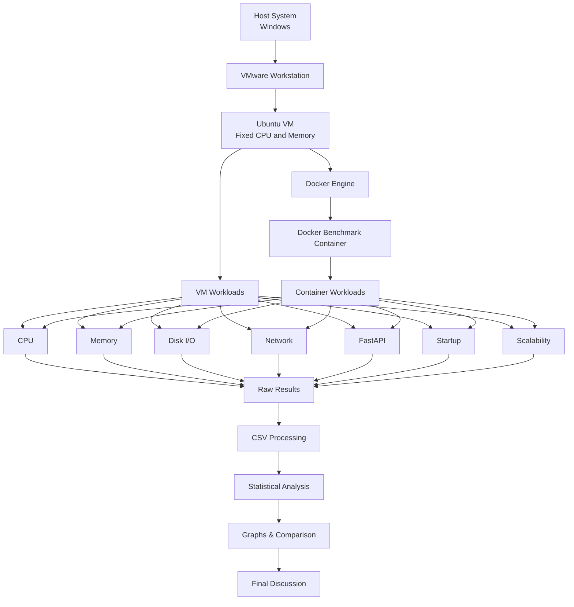

The experiment follows the same overall methodology described in the lab manual: controlled environments, equivalent workloads, repeated measurements, raw-data preservation, structured processing, statistical analysis, graphs, and final comparison.

---

## Hardware Configuration

The actual VM configuration used in this experiment was:

| Parameter              | Actual Configuration          |
| ---------------------- | ----------------------------- |
| Host OS                | Windows                       |
| Hypervisor             | VMware Workstation            |
| Guest OS               | Ubuntu                        |
| CPU                    | 4 vCPUs                       |
| Memory                 | Approximately 4.8 GiB RAM     |
| Swap                   | 4 GiB                         |
| Network                | VMware virtual network        |
| VM resource allocation | Kept fixed during experiments |

The detailed configuration is also recorded in:

```text
docs/vm-configuration.txt
docs/cpu-info.txt
docs/memory-info.txt
docs/storage-info.txt
docs/kernel-info.txt
```

---

## Software Configuration

The project uses the following tools and technologies:

| Component             | Technology              |
| --------------------- | ----------------------- |
| Virtualization        | VMware Workstation      |
| Containerization      | Docker                  |
| Guest OS              | Ubuntu                  |
| CPU Benchmark         | Sysbench                |
| Disk Benchmark        | fio                     |
| Network Benchmark     | iperf3                  |
| Application           | FastAPI + Uvicorn       |
| Application Benchmark | Apache Benchmark (`ab`) |
| API Scalability       | wrk                     |
| Data Processing       | Python + Pandas         |
| Numerical Analysis    | NumPy                   |
| Visualization         | Matplotlib              |
| Notebook Analysis     | Jupyter                 |
| Version Control       | Git + GitHub            |

Benchmark versions observed during the experiment include:

```text
Sysbench 1.0.20
fio 3.36
Python 3.12.13
```

The complete environment records should be consulted for the exact system configuration.

---

# Methodology

The comparison was performed using controlled resource allocation and repeated measurements.

The main principle was to execute comparable workloads in the VM and container environments while keeping the benchmark parameters consistent wherever possible.

The workflow was:

```text
Environment Preparation
        ↓
VM Configuration
        ↓
Docker Configuration
        ↓
Baseline Measurement
        ↓
CPU Benchmark
        ↓
Memory Benchmark
        ↓
Disk I/O Benchmark
        ↓
Network Benchmark
        ↓
FastAPI Benchmark
        ↓
Startup-Time Test
        ↓
Scalability Tests
        ↓
Raw Data Collection
        ↓
CSV Processing
        ↓
Statistical Analysis
        ↓
Graphs and Comparison
        ↓
Final Discussion
```

Raw outputs are stored separately from processed values:

```text
results/raw/
results/processed/
results/figures/
```

This preserves the original benchmark outputs while allowing structured analysis of the measured data.

---

# CPU Experiment

## Workload

CPU performance was measured using **Sysbench CPU prime-number calculations**.

Main workload configuration:

```text
CPU benchmark:
Prime limit      = 20000
Threads          = 4
Duration         = 30 seconds
Metric           = Events per second
```

Ten repeated runs were collected for both environments.

CPU scalability was additionally tested at:

```text
1 thread
2 threads
4 threads
8 threads
```

### CPU Results

Average CPU performance:

| Environment | Mean Events/sec |
| ----------- | --------------: |
| VM          |         5522.52 |
| Container   |         5552.60 |

Container versus VM percentage difference:

```text
+0.54%
```

The complete repeated measurements are available in:

```text
results/processed/cpu_results.csv
```

CPU scalability data:

```text
results/processed/cpu_scalability.csv
```

### CPU Graph

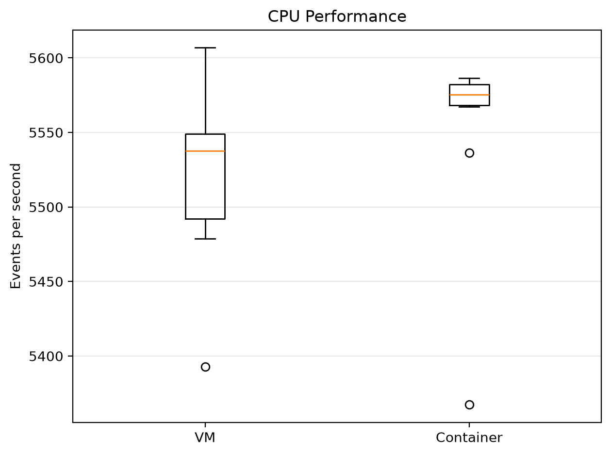

### CPU Scalability

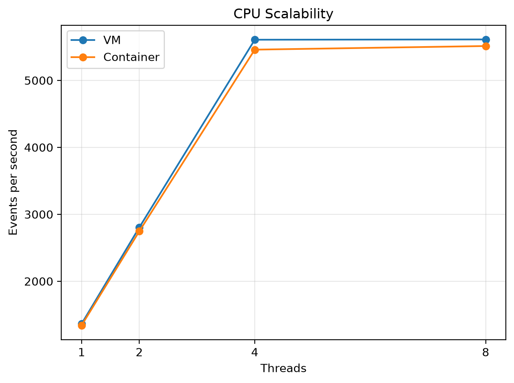

---

# Memory Experiment

Memory performance was measured using **Sysbench memory operations**.

The intended manual configuration uses:

```text
Block size = 1 MiB
Total size = 10 GiB
Threads    = 4
```

### Experimental Adjustment

The actual VM had approximately **4.8 GiB RAM**. Therefore, the memory workload was reduced to:

```text
Block size = 1 MiB
Total size = 2 GiB
Threads    = 4
Operation  = Write
```

This adjustment was made so that the benchmark remained feasible within the available VM memory.

The deviation is explicitly documented rather than presenting the experiment as if the original 10 GiB workload had been executed.

Ten repeated measurements were collected for both environments.

### Memory Results

Average measured memory throughput:

| Environment |  Mean Throughput |
| ----------- | ---------------: |
| VM          | 66625.29 MiB/sec |
| Container   | 46467.34 MiB/sec |

Container versus VM measured difference:

```text
-30.26%
```

Results:

```text
results/processed/memory_results.csv
```

### Memory Graph

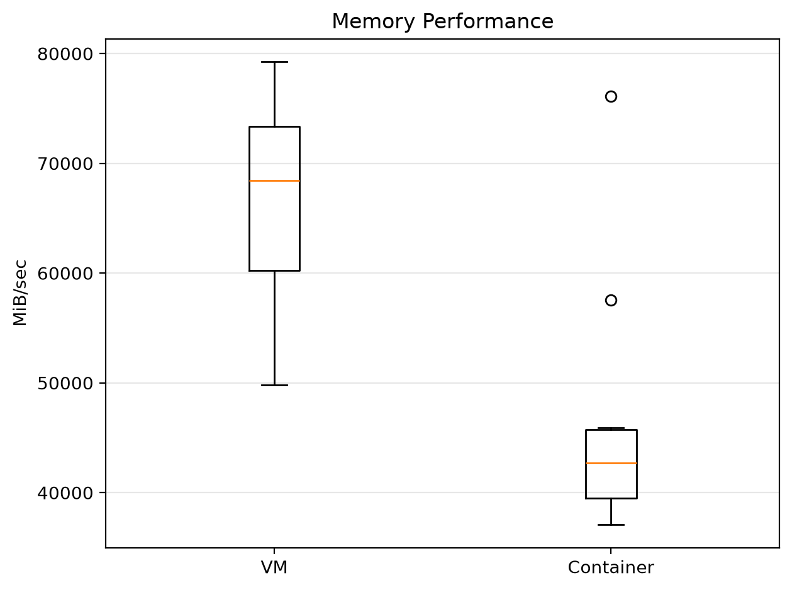

---

# Disk I/O Experiment

Disk performance was evaluated using `fio`.

The following workloads were measured:

```text
Sequential Read
Sequential Write
Random Read
Random Write
```

Main characteristics included:

```text
Sequential block size = 1 MiB
Random block size     = 4 KiB
Test size             = 2 GiB
Direct I/O            = Enabled
I/O depth             = 16
Runtime               = 30 seconds
```

Both bandwidth and IOPS were collected.

### Disk Results

| Operation        | VM Bandwidth | Container Bandwidth | Container vs VM |
| ---------------- | -----------: | ------------------: | --------------: |
| Sequential Read  |   1134 MiB/s |          1334 MiB/s |         +17.64% |
| Sequential Write |    864 MiB/s |          1704 MiB/s |         +97.22% |
| Random Read      |   36.6 MiB/s |          46.0 MiB/s |         +25.68% |
| Random Write     |   33.2 MiB/s |          33.7 MiB/s |          +1.51% |

### Disk IOPS

| Operation        | VM IOPS | Container IOPS | Container vs VM |
| ---------------- | ------: | -------------: | --------------: |
| Sequential Read  |    1134 |           1334 |         +17.64% |
| Sequential Write |     864 |           1703 |         +97.11% |
| Random Read      |    9372 |          11800 |         +25.91% |
| Random Write     |    8489 |           8632 |          +1.68% |

Results:

```text
results/processed/disk_results.csv
```

### Disk Bandwidth

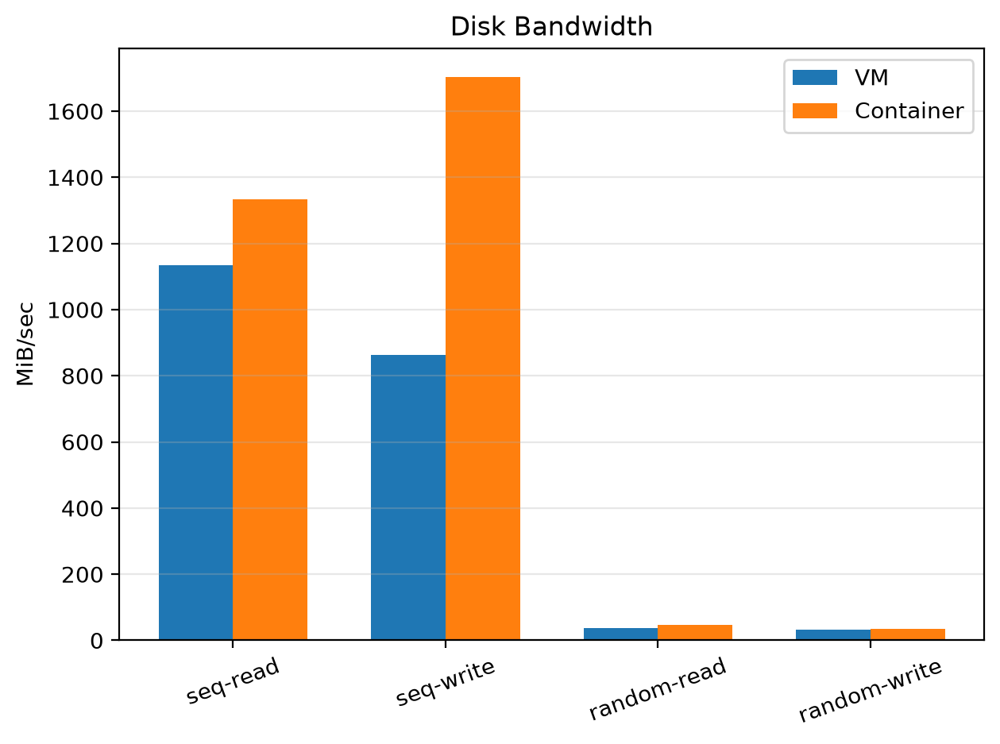

### Disk IOPS

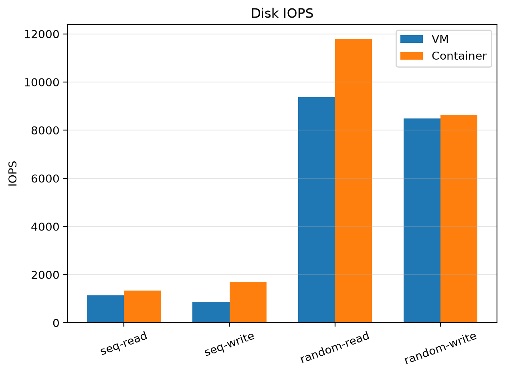

---

# Network Experiment

Network performance was measured using `iperf3`.

Two configurations were collected:

```text
iperf3
iperf3_P4
```

where the second configuration uses parallel streams.

The measured path was a local/virtual network path used for the experiment. Therefore, these measurements should not be interpreted as general Internet throughput.

### Network Results

| Test      |             VM |      Container | Container vs VM |
| --------- | -------------: | -------------: | --------------: |
| iperf3    | 84.3 Gbits/sec | 82.0 Gbits/sec |          -2.73% |
| iperf3_P4 |  259 Gbits/sec |  250 Gbits/sec |          -3.47% |

Raw results:

```text
results/raw/network/
```

Processed results:

```text
results/processed/network_results.csv
```

### Network Graph

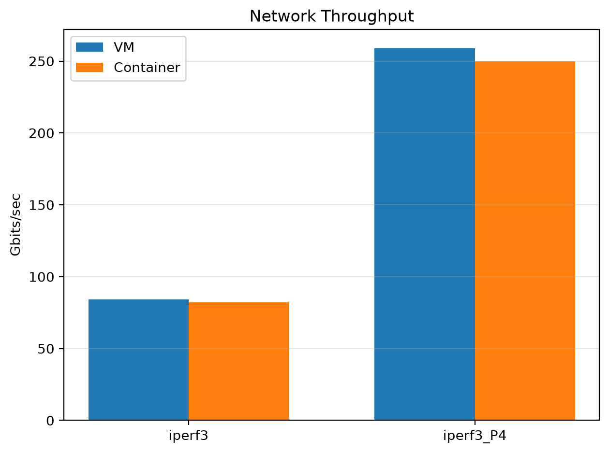

---

# Application Experiment

A FastAPI application was used to provide a realistic application workload in addition to synthetic benchmarks.

The application contains endpoints for:

```text
/health
/compute
```

The `/health` endpoint provides a lightweight application workload.

The `/compute` endpoint performs computational work and therefore produces a more CPU-intensive application workload.

The same application source was used for both the VM and container environments.

Application source:

```text
api/main.py
```

Container configuration:

```text
api/Dockerfile
api/requirements.txt
```

Apache Benchmark was used with:

### Health Endpoint

```text
10000 requests
Concurrency = 100
```

### Compute Endpoint

```text
1000 requests
Concurrency = 10
```

### Application Results

| Endpoint | VM Req/sec | Container Req/sec | Difference |
| -------- | ---------: | ----------------: | ---------: |
| Health   |    2212.07 |           2496.18 |    +12.84% |
| Compute  |      34.94 |             30.84 |    -11.73% |

Application latency:

| Endpoint | VM Latency | Container Latency | Difference |
| -------- | ---------: | ----------------: | ---------: |
| Health   |  45.206 ms |         40.061 ms |    -11.38% |
| Compute  | 286.199 ms |        324.281 ms |    +13.31% |

All recorded application benchmark results are stored in:

```text
results/processed/application_results.csv
```

### Application Throughput

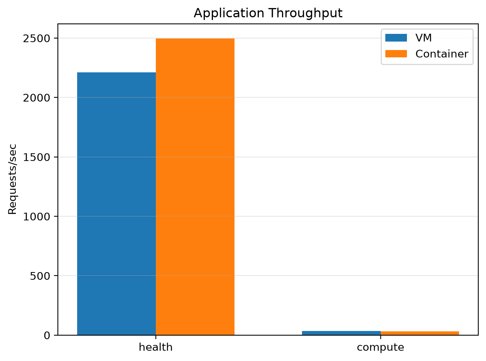

### Application Latency

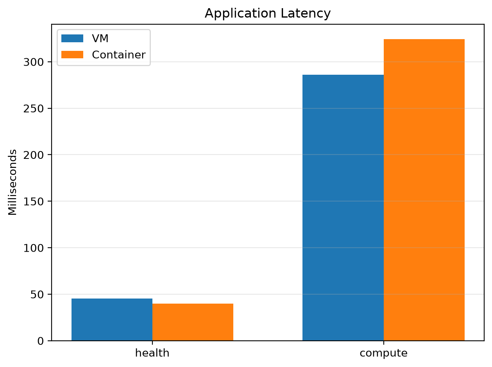

---

# Startup-Time Experiment

Startup performance was measured through repeated application-ready measurements.

Five runs were collected for each environment.

### Startup Results

| Environment | Mean Startup Time |
| ----------- | ----------------: |
| VM          |            350 ms |
| Container   |            635 ms |

Recorded measurements:

```text
VM:
316 ms
300 ms
408 ms
385 ms
341 ms

Container:
622 ms
627 ms
613 ms
677 ms
636 ms
```

The measured container-versus-VM difference in mean startup time was:

```text
+81.43%
```

Results:

```text
results/processed/startup_results.csv
```

### Startup Graph

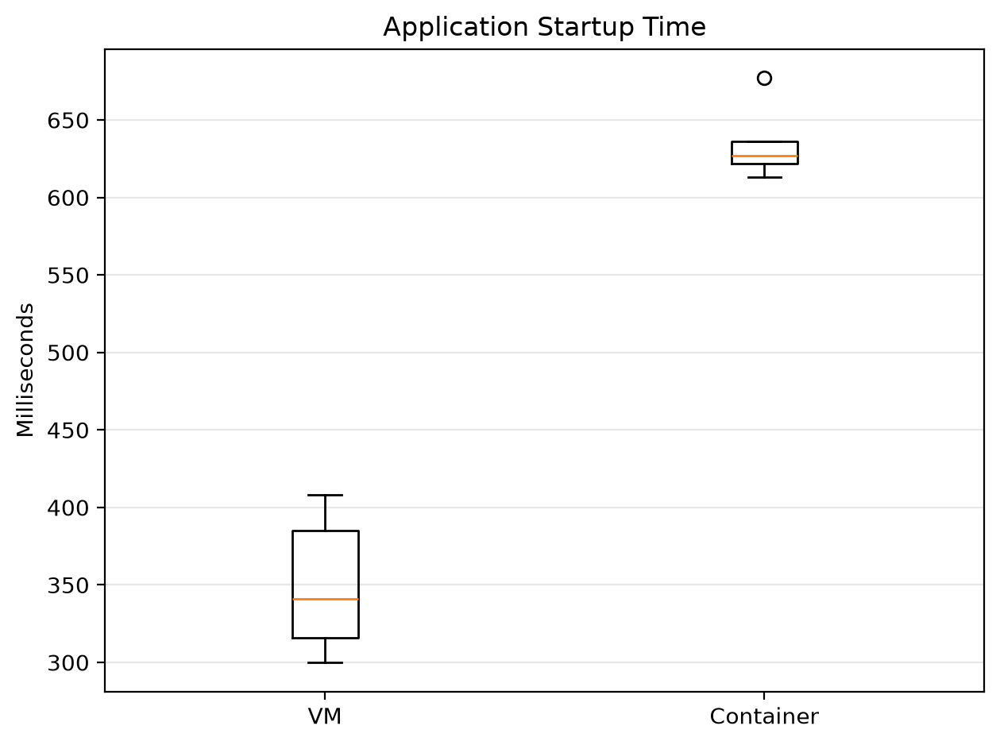

---

# Scalability Experiment

Scalability was tested by increasing the workload level.

## CPU Scalability

CPU workloads were evaluated using:

```text
1 thread
2 threads
4 threads
8 threads
```

Measured container-versus-VM differences:

| Threads | Difference |
| ------: | ---------: |
|       1 |     -1.71% |
|       2 |     -2.04% |
|       4 |     -2.64% |
|       8 |     -1.76% |

Results:

```text
results/processed/cpu_scalability.csv
```

---

## API Scalability

API scalability was evaluated with increasing request workload levels based on the manual's scalability configurations.

| Workload Level | Thread / Connection Configuration |
| -------------- | --------------------------------- |
| 1              | 1 thread / 10 connections         |
| 2              | 2 threads / 50 connections        |
| 4              | 4 threads / 100 connections       |
| 8              | 4 threads / 200 connections       |

Measured throughput:

| Workload | VM Req/sec | Container Req/sec | Difference |
| -------- | ---------: | ----------------: | ---------: |
| 1        |    2879.12 |           3317.02 |    +15.21% |
| 2        |    3009.00 |           3897.71 |    +29.54% |
| 4        |    3022.74 |           3760.39 |    +24.40% |
| 8        |    2709.11 |           3341.97 |    +23.36% |

Measured latency:

| Workload | VM Latency | Container Latency | Difference |
| -------- | ---------: | ----------------: | ---------: |
| 1        |    3.57 ms |           3.15 ms |    -11.76% |
| 2        |   16.66 ms |          12.86 ms |    -22.81% |
| 4        |   33.06 ms |          26.60 ms |    -19.54% |
| 8        |   73.70 ms |          59.75 ms |    -18.93% |

Results:

```text
results/processed/api_scalability.csv
```

### API Scalability Graph

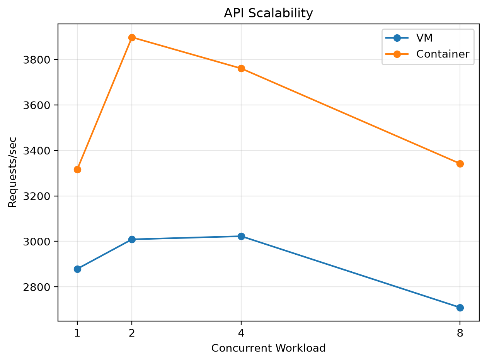

---

# Results

The project produced measurements across CPU, memory, disk, network, application, startup, and scalability workloads.

The processed results are maintained as CSV files so that the raw measurements remain separate from derived analysis.

Main processed datasets:

```text
results/processed/
├── cpu_results.csv
├── cpu_scalability.csv
├── memory_results.csv
├── disk_results.csv
├── network_results.csv
├── application_results.csv
├── startup_results.csv
├── api_scalability.csv
├── statistics.csv
└── final_comparison.csv
```

---

# Statistical Analysis

Repeated benchmark runs were used where applicable.

For repeated measurements, the project calculates:

```text
Mean
Median
Minimum
Maximum
Standard Deviation
```

These statistics help describe both central performance and variation between runs.

For throughput-style metrics, the project uses:

```text
Difference (%) =
((Container - VM) / VM) × 100
```

For execution-time-style metrics where applicable:

```text
Difference (%) =
((VM - Container) / VM) × 100
```

The calculation is selected according to the metric being analyzed.

Statistical results are available in:

```text
results/processed/statistics.csv
```

The final comparison dataset is available in:

```text
results/processed/final_comparison.csv
```

---

# VM vs Container Comparison

The following summarizes the measured differences obtained from this experiment.

| Metric              |                 VM |          Container | Measured Difference |
| ------------------- | -----------------: | -----------------: | ------------------: |
| CPU Performance     | 5522.52 events/sec | 5552.60 events/sec |              +0.54% |
| Memory Throughput   |   66625.29 MiB/sec |   46467.34 MiB/sec |             -30.26% |
| Sequential Read     |         1134 MiB/s |         1334 MiB/s |             +17.64% |
| Sequential Write    |          864 MiB/s |         1704 MiB/s |             +97.22% |
| Random Read         |         36.6 MiB/s |         46.0 MiB/s |             +25.68% |
| Random Write        |         33.2 MiB/s |         33.7 MiB/s |              +1.51% |
| Network `iperf3`    |     84.3 Gbits/sec |     82.0 Gbits/sec |              -2.73% |
| Network `iperf3_P4` |      259 Gbits/sec |      250 Gbits/sec |              -3.47% |
| API Health          |    2212.07 req/sec |    2496.18 req/sec |             +12.84% |
| API Compute         |      34.94 req/sec |      30.84 req/sec |             -11.73% |
| Startup Time        |             350 ms |             635 ms |             +81.43% |

These values describe the measured outcomes of this particular experimental configuration. They should not be treated as universal performance characteristics of all VMs or containers.

---

# Discussion

The measurements show that performance behavior depends strongly on the workload rather than following one universal pattern.

The CPU benchmark produced very similar average event rates between the two environments. CPU scalability also remained relatively close across the tested thread counts.

The memory benchmark showed a noticeable difference in measured throughput under the selected 2 GiB workload.

Disk behavior varied according to access pattern. The measured sequential and random operations did not show the same magnitude of difference across all workloads.

Network measurements were also relatively close, although the container measurements were lower for the two tested `iperf3` configurations.

Application results depended on workload type. The lightweight health endpoint and the computational `/compute` endpoint exhibited different throughput and latency behavior.

Startup measurements also showed a clear difference between the two tested environments under the selected application startup procedure.

The API scalability experiment demonstrated that increasing workload changes both throughput and latency. The measurements therefore emphasize the importance of evaluating deployment environments using workloads representative of the intended application rather than relying on a single benchmark.

---

# Limitations

The following limitations should be considered when interpreting the results.

### 1. Memory workload adjustment

The lab manual specifies a 10 GiB Sysbench memory workload. The actual VM had approximately 4.8 GiB RAM, so this experiment used a 2 GiB workload instead.

Therefore, the memory results should be interpreted as measurements for the actual 2 GiB configuration rather than as a direct reproduction of the manual's 10 GiB workload.

### 2. Experimental hardware

The measurements were collected on one host system with one fixed VM configuration. Results may differ on other processors, storage devices, memory configurations, operating systems, or hypervisors.

### 3. Network test scope

The `iperf3` measurements represent the selected local/virtual network path used in the experiment. They are not Internet throughput measurements.

### 4. Storage environment

Disk performance depends on the underlying storage device, virtualization layer, filesystem, Docker storage configuration, and benchmark path. Storage results should therefore be interpreted together with the recorded system configuration.

### 5. Application workload

The FastAPI workload is intentionally small and controlled. It does not represent a complete production application with databases, external services, caches, or distributed traffic.

### 6. Benchmark duration and repetitions

Although repeated measurements were collected for several experiments, additional repetitions and different machines could provide a broader assessment.

### 7. Scope of scalability testing

The scalability study uses the workload levels implemented for this experiment. It does not include Kubernetes replicas, autoscaling, multi-host deployment, or distributed container orchestration.

---

# Conclusion

This project provides an experimental comparison of VM and Docker container behavior across multiple performance dimensions.

The measurements demonstrate that VM-versus-container behavior is workload-dependent. CPU results were closely matched in the tested configuration, while differences were observed in memory throughput, storage workloads, network throughput, application workloads, startup time, and API scalability.

The project therefore evaluates the environments through measured evidence rather than assuming in advance that one deployment model will always outperform the other.

The final conclusions are based on:

```text
Actual benchmark measurements
Repeated runs
Processed CSV datasets
Statistical summaries
Performance-difference calculations
Graphs
Documented configuration
```

---

# Future Work

The experiment can be extended in several directions:

* Repeat the study on systems with larger RAM so that the manual's 10 GiB memory workload can be executed directly.
* Add additional CPU and memory workload types.
* Evaluate more storage configurations and filesystem settings.
* Test different Docker network modes.
* Add longer-running benchmark campaigns and larger repetitions.
* Extend API scalability to higher concurrency levels.
* Add container resource-utilization monitoring to the processed analysis.
* Compare multiple containers and replicas.
* Extend the experiment to Kubernetes deployments and autoscaling.
* Evaluate performance across multiple physical hosts.
* Add confidence intervals and additional statistical tests to the analysis.

---

# Reproduction Instructions

## 1. Clone the repository

```bash
git clone https://github.com/Zakiya-t/vm-vs-container-performance.git
cd vm-vs-container-performance
```

## 2. Verify the project structure

```bash
pwd
find . -maxdepth 2 -type f | sort
```

The project contains:

```text
README.md
docs/
api/
docker/
scripts/
results/raw/
results/processed/
results/figures/
analysis/
```

## 3. Create and activate a Python virtual environment

```bash
python3 -m venv .venv
source .venv/bin/activate
```

## 4. Install analysis packages

```bash
python -m pip install pandas numpy matplotlib notebook
```

## 5. Process the benchmark results

From the project root:

```bash
python analysis/process_results.py
```

## 6. Generate comparison data

```bash
python analysis/create_comparison.py
```

## 7. Generate graphs

```bash
python analysis/generate_plots.py
```

Generated figures are stored in:

```text
results/figures/
```

## 8. Open the analysis notebook

```bash
jupyter notebook
```

Open:

```text
analysis/analysis.ipynb
```

The notebook provides the analysis workflow using the processed experiment data.

## 9. Inspect the raw benchmark outputs

Raw benchmark outputs are preserved under:

```text
results/raw/
```

They include separate VM and container measurements.

---

# Repository Structure

```text
vm-vs-container-performance/
│
├── README.md
├── .gitignore
│
├── analysis/
│   ├── analysis.ipynb
│   ├── comparison_summary.md
│   ├── create_comparison.py
│   ├── generate_plots.py
│   └── process_results.py
│
├── api/
│   ├── Dockerfile
│   ├── main.py
│   └── requirements.txt
│
├── docker/
│   └── Dockerfile
│
├── docs/
│   ├── cpu-info.txt
│   ├── kernel-info.txt
│   ├── memory-info.txt
│   ├── storage-info.txt
│   ├── vm-configuration.txt
│   └── methodology.md
│
├── results/
│   ├── raw/
│   │   ├── application/
│   │   ├── baseline/
│   │   ├── cpu/
│   │   ├── disk/
│   │   ├── memory/
│   │   ├── network/
│   │   ├── scalability/
│   │   └── startup/
│   │
│   ├── processed/
│   │   ├── api_scalability.csv
│   │   ├── application_results.csv
│   │   ├── cpu_results.csv
│   │   ├── cpu_scalability.csv
│   │   ├── disk_results.csv
│   │   ├── final_comparison.csv
│   │   ├── memory_results.csv
│   │   ├── network_results.csv
│   │   ├── startup_results.csv
│   │   └── statistics.csv
│   │
│   └── figures/
│       ├── 01_cpu_performance.png
│       ├── 02_memory_performance.png
│       ├── 03_disk_bandwidth.png
│       ├── 04_disk_iops.png
│       ├── 05_network_throughput.png
│       ├── 06_application_throughput.png
│       ├── 07_application_latency.png
│       ├── 08_startup_time.png
│       ├── 09_cpu_scalability.png
│       └── 10_api_scalability.png
│
└── scripts/
    └── run_cpu.sh
```

---

# Results and Figures

The project contains the complete set of generated comparison figures:

### CPU Performance


### Memory Performance


### Disk Bandwidth


### Disk IOPS


### Network Throughput


### Application Throughput


### Application Latency


### Startup Time


### CPU Scalability


### API Scalability


---

# Data Integrity and Reproducibility

The repository keeps three levels of experimental information:

```text
Raw Benchmark Output
        ↓
Processed CSV Data
        ↓
Statistical Analysis and Figures
```

Raw measurements under:

```text
results/raw/
```

are preserved separately from processed values under:

```text
results/processed/
```

Generated figures are stored under:

```text
results/figures/
```

This organization allows the numerical results to be traced back to the original benchmark outputs.

---

# GitHub

Repository:

```text
https://github.com/Zakiya-t/vm-vs-container-performance
```

The project is maintained using Git and GitHub.

Typical future update workflow:

```bash
git status
git add .
git commit -m "Describe the update"
git push
```

---

# Reference

**Performance Analysis of Virtual Machines and Containers — Lab Manual**

The methodology, benchmark categories, project organization, statistical analysis approach, README requirements, and GitHub workflow follow the supplied lab manual while documenting the actual configuration and measured results of this experiment.
