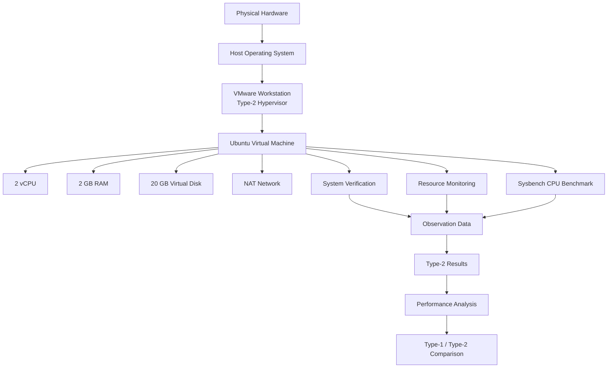

# ⚡ Performance Analysis of Type-2 Hypervisor

## VMware Workstation Virtual Machine Performance Analysis


> **A practical performance-analysis experiment using VMware Workstation to study the behavior of an Ubuntu virtual machine running on a Type-2 hypervisor.**

---

# 📌 Overview

This project implements the **Type-2 Hypervisor performance-analysis experiment** using **VMware Workstation**.

The experiment creates an Ubuntu virtual machine using VMware Workstation, configures fixed virtual hardware resources, verifies the guest configuration, monitors resource utilization, and evaluates CPU performance using **Sysbench**.

The resulting measurements form the **Type-2 hypervisor dataset** used for observation and later comparison with the Type-1 hypervisor environment.

According to the supplied laboratory manual, VMware Workstation is a **Type-2 hypervisor**, meaning it operates on top of a host operating system. The experiment uses the same basic guest resource configuration as the Type-1 part so that the two hypervisor environments can later be compared.

---

# 🎯 Objectives

The main objectives of this experiment are to:

* Understand the working environment of a **Type-2 hypervisor**.
* Create a virtual machine using VMware Workstation.
* Install Ubuntu as the guest operating system.
* Configure fixed CPU, memory, storage, and network resources.
* Verify the VM's hardware and operating-system configuration.
* Monitor CPU and memory utilization.
* Install and execute Sysbench.
* Measure CPU performance and latency.
* Record the benchmark observations.
* Preserve the resulting data for analysis and comparison with the Type-1 hypervisor.

---

# 🧠 What is a Type-2 Hypervisor?

A **Type-2 hypervisor** runs on top of a host operating system.

The basic architecture used in this experiment is:

```text
┌───────────────────────────────┐
│       Physical Hardware       │
└───────────────┬───────────────┘
                │
                ▼
┌───────────────────────────────┐
│       Host Operating System   │
│            Windows            │
└───────────────┬───────────────┘
                │
                ▼
┌───────────────────────────────┐
│      VMware Workstation       │
│       Type-2 Hypervisor       │
└───────────────┬───────────────┘
                │
                ▼
┌───────────────────────────────┐
│           Ubuntu VM           │
│                               │
│  CPU     → 2 vCPU             │
│  Memory  → 2 GB               │
│  Disk    → 20 GB              │
│  Network → NAT                │
└───────────────────────────────┘
```

The laboratory manual explicitly defines VMware Workstation as the Type-2 environment for **Part B** of the experiment.

---

# 🏗️ Experimental Architecture



---

# 🖥️ Experimental Environment

| Component               | Configuration                |
| ----------------------- | ---------------------------- |
| Hypervisor              | **VMware Workstation**       |
| Hypervisor Type         | **Type-2**                   |
| Host Operating System   | Windows                      |
| Guest Operating System  | Ubuntu                       |
| CPU Allocation          | 2 vCPU                       |
| Memory Allocation       | 2048 MB / 2 GB               |
| Virtual Disk            | 20 GB                        |
| Network Mode            | NAT                          |
| Processor Configuration | 1 processor × 2 cores        |
| VM Configuration        | Typical                      |
| Virtual Disk Storage    | Single file / default option |

## These values follow the VMware Workstation configuration specified in the supplied manual.

# 🧰 VMware Workstation Setup

The Type-2 VM creation workflow is:

```text
Launch VMware Workstation
        ↓
Create a New Virtual Machine
        ↓
Select Typical Configuration
        ↓
Select Ubuntu ISO
        ↓
Configure VM Name and Location
        ↓
Configure 20 GB Virtual Disk
        ↓
Customize Hardware
        ↓
Configure 2 vCPU
        ↓
Configure 2 GB RAM
        ↓
Configure Network
        ↓
Finish VM Creation
        ↓
Power On VM
        ↓
Install Ubuntu
```

The manual specifies **Typical (recommended)** VM configuration and Ubuntu installation media for the VMware workflow.

---

# ⚙️ Virtual Machine Configuration

## Operating System

The guest operating system is:

```text
Ubuntu
```

The VM is created using an Ubuntu ISO image.

---

## Processor Configuration

The manual specifies:

```text
Number of Processors      = 1
Number of Cores/Processor = 2
--------------------------------
Total Virtual CPUs        = 2
```

---

## Memory Configuration

```text
Memory = 2048 MB
       = 2 GB RAM
```

---

## Virtual Disk

```text
Maximum Disk Size = 20 GB
```

The manual specifies storing the virtual disk as a single file/default option.

---

## Network Configuration

The recommended network configuration in the VMware section is:

```text
Network Adapter = NAT
```

The manual describes NAT as allowing the virtual machine to access the network through the host system.

---

# ✅ VM Verification

After Ubuntu installation, the virtual machine is verified from inside the guest operating system.

## Operating System and Kernel

```bash
hostnamectl
```

Verify:

```text
Hostname
Operating System
Kernel Version
Architecture
```

---

## CPU Configuration

```bash
lscpu
```

Observe:

```text
Architecture
CPU(s)
CPU Model
Number of Cores
Virtualization Type
```

The expected allocation is approximately:

```text
2 Virtual CPUs
```

---

## Memory Configuration

```bash
free -h
```

Observe:

```text
Total Memory
Used Memory
Free Memory
Available Memory
```

Expected allocation:

```text
Approximately 2 GB
```

---

## Disk Configuration

```bash
df -h
```

Observe:

```text
Filesystem
Total Capacity
Used Space
Available Space
```

These verification steps are explicitly described in the Type-2 portion of the supplied manual.

---

# 📊 Resource Monitoring

System resource utilization is monitored from inside the Ubuntu VM.

Run:

```bash
top
```

Observe:

```text
CPU Utilization
Memory Utilization
Running Processes
Load Average
```

Exit with:

```text
q
```

The manual also identifies the VMware Workstation VM settings as the place to verify:

```text
Processors
Memory
Hard Disk
Network Adapter
```

---

# ⚙️ Sysbench Installation

Sysbench is used for the CPU performance experiment.

Install:

```bash
sudo apt update
sudo apt install sysbench -y
```

Verify:

```bash
sysbench --version
```

The manual specifies Sysbench as the CPU-performance measurement tool.

---

# 🚀 CPU Performance Benchmark

The Type-2 CPU benchmark is executed using:

```bash
sysbench cpu --cpu-max-prime=20000 run
```

The benchmark produces several performance measurements.

The following values are recorded:

```text
Total Execution Time
Total Number of Events
Events per Second
Minimum Latency
Average Latency
Maximum Latency
```

This exactly follows the Type-2 CPU analysis procedure in the supplied manual.

---

# 📈 Type-2 Performance Results

> **Replace the placeholder paths and values below with the actual files and measurements from your `results/` folder.**

## Raw Benchmark Output

📄 **[View Type-2 Raw CPU Result](results/type2/raw/cpu.txt)**

> Replace this path with the exact raw-result file in your repository.

---

## Processed Result

📊 **[View Type-2 Processed CPU Result](results/type2/processed/cpu_results.csv)**

> Replace this path with the exact processed CSV in your repository.

---

## Type-2 Observation Table

| Parameter              | Observation             |
| ---------------------- | ----------------------- |
| Hypervisor             | VMware Workstation      |
| Hypervisor Type        | Type-2                  |
| Guest Operating System | Ubuntu                  |
| CPU Allocation         | 2 vCPU                  |
| Memory Allocation      | 2 GB                    |
| Disk Allocation        | 20 GB                   |
| Network                | NAT                     |
| Total Execution Time   | **[ADD ACTUAL RESULT]** |
| Total Events           | **[ADD ACTUAL RESULT]** |
| Events per Second      | **[ADD ACTUAL RESULT]** |
| Minimum Latency        | **[ADD ACTUAL RESULT]** |
| Average Latency        | **[ADD ACTUAL RESULT]** |
| Maximum Latency        | **[ADD ACTUAL RESULT]** |

The manual provides these same observation categories for the Type-2 hypervisor.

---

# 📊 Performance Graph

Add the actual Type-2 graph from your `results/` directory here.

```markdown

```

Or use a repository link:

📈 **[View Type-2 CPU Performance Graph](results/type2/figures/cpu_performance.png)**

> Replace the placeholder path with the actual graph location.

---

# 🔬 Recorded Type-2 Results

The manual provides a final Type-2 performance-results table containing:

| Performance Metric   | Result             |
| -------------------- | ------------------ |
| Hypervisor           | VMware Workstation |
| Hypervisor Type      | Type-2             |
| CPU Configuration    | 2 vCPU             |
| Memory Configuration | 2 GB               |
| Disk Configuration   | 20 GB              |
| Total Execution Time | **[ADD RESULT]**   |
| Total Events         | **[ADD RESULT]**   |
| Events per Second    | **[ADD RESULT]**   |
| Minimum Latency      | **[ADD RESULT]**   |
| Average Latency      | **[ADD RESULT]**   |
| Maximum Latency      | **[ADD RESULT]**   |

---

# 📝 Key Observations

The Type-2 experiment focuses on observing an Ubuntu virtual machine running through VMware Workstation.

The main observations include:

* VM processor allocation.
* Guest memory allocation.
* Virtual disk allocation.
* NAT-based network configuration.
* CPU utilization during execution.
* Memory utilization during execution.
* Running processes and load average.
* Sysbench CPU throughput.
* CPU execution time.
* CPU latency statistics.

The actual performance interpretation should be made from the collected measurements.

---

# 🧪 Experimental Workflow

```text
                    START
                      │
                      ▼
          Launch VMware Workstation
                      │
                      ▼
            Create New VM
                      │
                      ▼
          Select Typical Setup
                      │
                      ▼
              Ubuntu ISO
                      │
                      ▼
            Configure 20 GB Disk
                      │
                      ▼
             Customize Hardware
                      │
              ┌───────┴────────┐
              ▼                ▼
          2 vCPU             2 GB RAM
              │                │
              └───────┬────────┘
                      ▼
                  NAT Network
                      │
                      ▼
               Finish VM Setup
                      │
                      ▼
                 Power On
                      │
                      ▼
              Install Ubuntu
                      │
                      ▼
              Verify Hardware
                      │
          ┌───────────┼───────────┐
          ▼           ▼           ▼
       hostnamectl   lscpu      free -h
                      │
                      ▼
                   df -h
                      │
                      ▼
              Monitor Resources
                      │
                      ▼
               Install Sysbench
                      │
                      ▼
              Run CPU Benchmark
                      │
                      ▼
              Record Measurements
                      │
                      ▼
               Store Results
                      │
                      ▼
             Analyze Performance
                      │
                      ▼
                 Shut Down VM
                      │
                      ▼
                     END
```

The workflow corresponds to the Type-2 workflow summarized in the manual.

---

# 📁 Results Organization

Keep the actual result files in the repository's `results/` directory.

Recommended logical organization:

```text
results/
│
└── type2/
    │
    ├── raw/
    │   └── cpu.txt
    │
    ├── processed/
    │   └── cpu_results.csv
    │
    └── figures/
        └── cpu_performance.png
```

> These are placeholders for README organization. Replace the paths with your repository's actual Type-2 result locations.

---

# 🔁 Reproducibility

## Step 1 — Launch VMware Workstation

Open VMware Workstation on the host system.

---

## Step 2 — Create a New Virtual Machine

Select:

```text
Create a New Virtual Machine
```

Choose:

```text
Typical (recommended)
```

---

## Step 3 — Select Ubuntu ISO

Select:

```text
Installer disc image file (ISO)
```

and choose the Ubuntu ISO.

---

## Step 4 — Configure Virtual Disk

Set:

```text
Maximum Disk Size = 20 GB
```

Use the default/single-file storage option specified by the manual.

---

## Step 5 — Customize Hardware

Configure:

```text
Processors:
1 processor × 2 cores

Memory:
2048 MB

Network:
NAT
```

---

## Step 6 — Install Ubuntu

Power on the VM and complete the Ubuntu installation.

---

## Step 7 — Verify the Configuration

Inside Ubuntu:

```bash
hostnamectl
lscpu
free -h
df -h
```

---

## Step 8 — Monitor Resources

```bash
top
```

Record CPU and memory behavior during the experiment.

---

## Step 9 — Install Sysbench

```bash
sudo apt update
sudo apt install sysbench -y
```

---

## Step 10 — Run the CPU Benchmark

```bash
sysbench cpu --cpu-max-prime=20000 run
```

Record:

```text
Execution Time
Total Events
Events/sec
Minimum Latency
Average Latency
Maximum Latency
```

---

## Step 11 — Store the Results

Save the raw output and any processed results under the repository's `results/` directory.

---

# 🆚 Relation to Type-1 Hypervisor

This experiment forms **Part B** of the laboratory manual.

The corresponding Type-1 environment uses:

```text
Proxmox VE
```

while this experiment uses:

```text
VMware Workstation
```

The manual specifies the VMware Workstation VM with:

```text
2 vCPU
2 GB RAM
20 GB Disk
Ubuntu
```

and uses this environment for Type-2 performance analysis.

The Type-1 section similarly records CPU, memory, disk, network, resource monitoring, and Sysbench CPU performance, allowing the two hypervisor environments to be studied using comparable guest configurations.

---

# 📊 Type-1 vs Type-2 Comparison

Once both experiments are completed, add the measured comparison here.

| Metric             | Type-1 — Proxmox VE | Type-2 — VMware Workstation |      Difference |
| ------------------ | ------------------: | --------------------------: | --------------: |
| CPU Execution Time |           **[ADD]** |                   **[ADD]** | **[CALCULATE]** |
| Total Events       |           **[ADD]** |                   **[ADD]** | **[CALCULATE]** |
| Events/sec         |           **[ADD]** |                   **[ADD]** | **[CALCULATE]** |
| Average Latency    |           **[ADD]** |                   **[ADD]** | **[CALCULATE]** |
| Minimum Latency    |           **[ADD]** |                   **[ADD]** | **[CALCULATE]** |
| Maximum Latency    |           **[ADD]** |                   **[ADD]** | **[CALCULATE]** |

> Do not enter assumed values. Populate this table only from the actual Type-1 and Type-2 measurements.

---

# 📈 Comparison Graph

After both datasets are available, add your actual comparison figure:

```markdown

```

📊 **[View Type-1 vs Type-2 CPU Comparison](results/comparison/type1_vs_type2_cpu.png)**

> Replace the path with your actual graph.

---

# 📚 Technologies Used

| Technology             | Purpose                           |
| ---------------------- | --------------------------------- |
| **VMware Workstation** | Type-2 hypervisor                 |
| **Ubuntu**             | Guest operating system            |
| **Sysbench**           | CPU performance benchmark         |
| **top**                | Resource monitoring               |
| **hostnamectl**        | OS/system verification            |
| **lscpu**              | CPU configuration verification    |
| **free**               | Memory configuration verification |
| **df**                 | Disk configuration verification   |

---

# ✅ Experiment Checklist

```text
☐ Launch VMware Workstation
☐ Create a new virtual machine
☐ Select Typical configuration
☐ Select Ubuntu ISO
☐ Configure 20 GB disk
☐ Configure 2 vCPU
☐ Configure 2 GB RAM
☐ Configure NAT networking
☐ Complete VM creation
☐ Power on VM
☐ Install Ubuntu
☐ Run hostnamectl
☐ Run lscpu
☐ Run free -h
☐ Run df -h
☐ Monitor using top
☐ Install Sysbench
☐ Run CPU benchmark
☐ Record execution time
☐ Record total events
☐ Record events/sec
☐ Record latency statistics
☐ Save raw result
☐ Save processed result
☐ Add performance graph
☐ Complete Type-2 analysis
☐ Compare with Type-1 results
☐ Shut down VM
```

---

# 🔒 Experimental Integrity

The README should contain only the measurements actually obtained during the experiment.

Important principles:

```text
Actual Configuration
        ↓
Actual Benchmark
        ↓
Actual Raw Output
        ↓
Processed Measurements
        ↓
Calculated Difference
        ↓
Observed Conclusion
```

No benchmark value should be replaced with example values from the laboratory manual.

---

# 📖 Reference

**Performance Analysis of Type-1 and Type-2 Hypervisors — Lab Manual**

**Part B: Performance Analysis Using Type-2 Hypervisor – VMware Workstation**

## The VM creation procedure, hardware configuration, verification commands, resource-monitoring procedure, Sysbench benchmark, observation table, and Type-2 workflow documented here are based on the supplied laboratory manual.

## 👩‍💻 Project

**Performance Analysis of Type-1 and Type-2 Hypervisors**

**Type-2 Platform:** VMware Workstation
**Hypervisor Type:** Type-2
**Guest OS:** Ubuntu
**CPU Benchmark:** Sysbench

